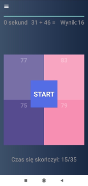

## Spis treści
* [Projekt](#Projekt)
* [Technologie](#technologie)
* [Opis aplikacji](#opis_aplikacji)

## Projekt
Aplikacja mobilna do nauki szybkiego liczenia w pamieci z wykorzystaniem metod Trachtenberga i matematyki wedyjskiej. Program ma na celu przybliżyć techniki szybkiego mnożenia, potęgowania, dodawania w pamięci z wykorzystaniem metod, które ułatwiają pracę na dużych liczbach.
## Technologie
Projekt został wykonany przy użyciu:
* Java
* Sqlite
* XML
## Opis aplikacji
Aplikacja została wykonana jako projekt inżynierski. W aplikacji znajdziemy dwie ścieżki nauczania, które bazują na podstawie wyżej wymienionych metod. Dodatkowo do aplikacji została dodana rozgrzewka polegająca na jak najszybszym dodawaniu liczb i wybraniu poprawnego wyniku z czterech losowych liczb i jednego poprawnego wyniku. Do każdego tematu z działów zostały zrobione testy sprawdzające umiejętności. Testy składają się z testów praktycznych, które losowo generują liczby i posiadają losowe odpowiedzi w tym jedną poprawną. Trudniejszy test, który posiada samo pytanie i sprawdza ciąg wprowadzonych znaków przez użytkownika, następnie porównuje z danym działaniem i przedstawia wynik. Testy teoretyczne które zawierają pytania,  przetrzymywane w bazie danych Sqlite. Po wykonanych zadaniach użytkownik może sprawdzić tablice wyników na której zapisują się trzy najlepsze wyniki z wszystkich gier. Wyniki są przetrzymywane w SharedPreferences. Dodatkowo do każdego działu użytkownik ma do wybrania kilka metod jakich może się nauczyć. Dla Trachtenberga będzie to 10 metod, a dla matematyki wedyjskiej 5. W dziale nauki znajduje się teoria, oraz zadania które generują losowe liczby, sprawdzają poprawność wyniku, lub zmieniają liczbę. Ostatnią zakładką jaką znajdziemy jest teoria do zadań, zawarta w formie opisu, lub rozwijanych przykładach.

